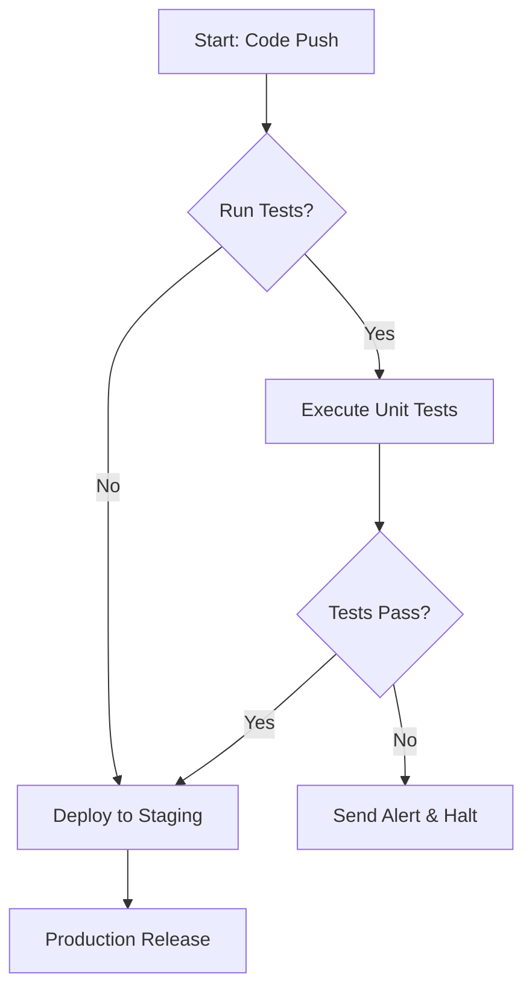
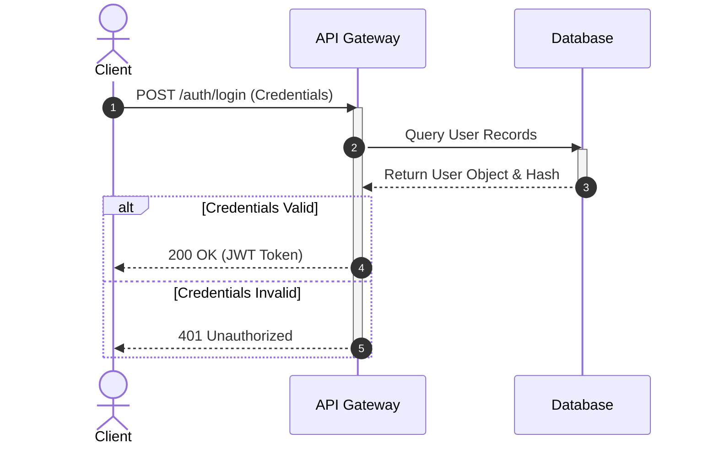
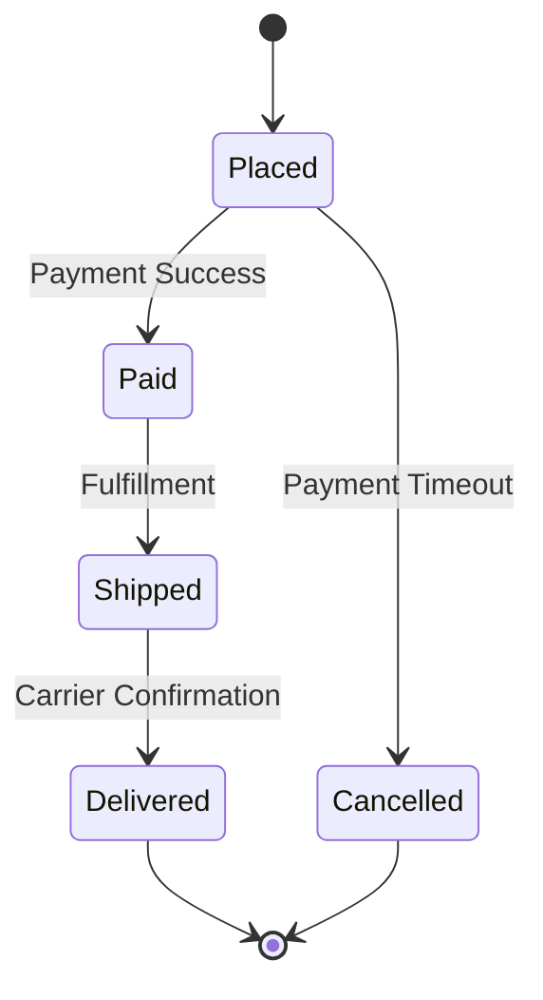
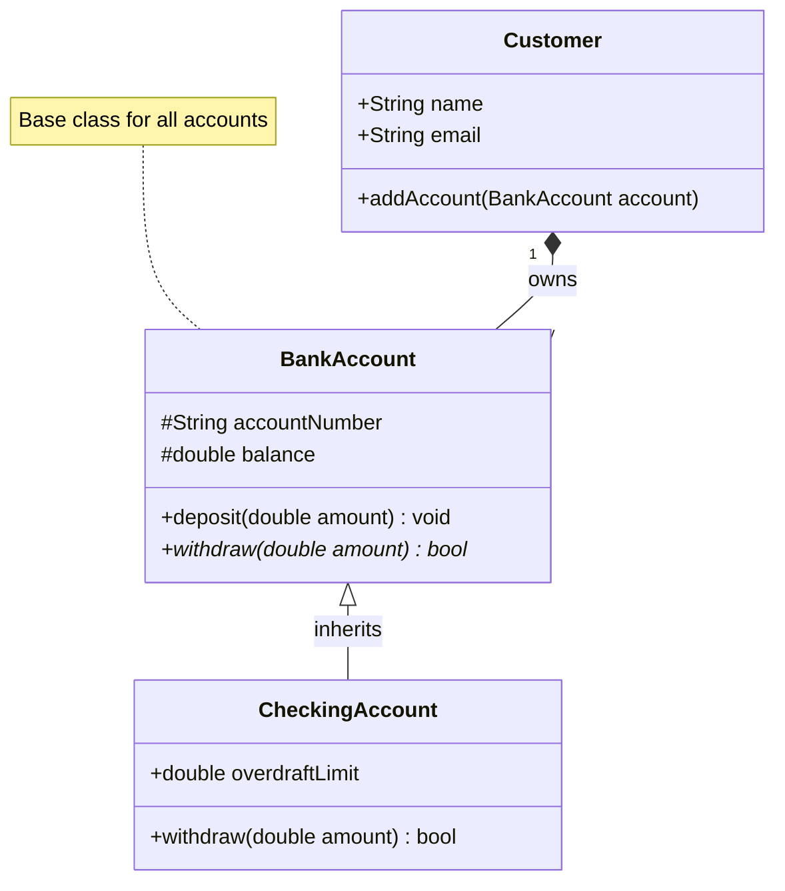

# Documentation Example with Mermaid Diagrams

This document contains several examples of using **Mermaid.js** syntax within Markdown fenced code blocks to create dynamic, text-based visualizations.

---

## 1. Flowchart
This flowchart maps out a simple decision-making process for an automated build pipeline.

---

## 2. Sequence Diagram
This diagram outlines the communication between a Client, an API Gateway, and a Database during a standard authentication request.

---

## 3. State Diagram
This diagram represents the lifecycles and transitions of an online shopping order.

---

## 4. Class Diagram
This object-oriented structure maps out the relationships (inheritance and composition) between a Bank Account base class, a Checking Account subclass, and a Customer entity.

